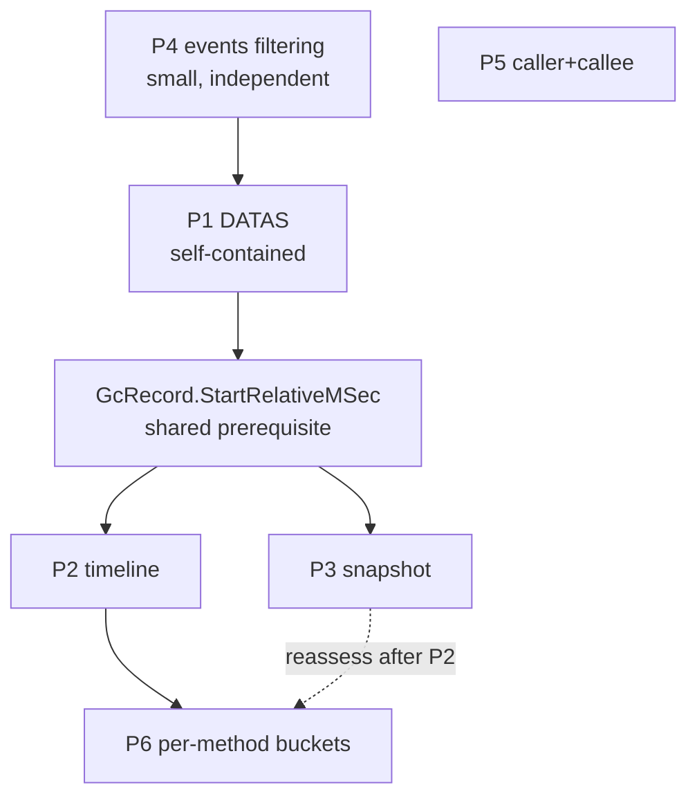

# filtrace improvement plan

A detailed, codebase-grounded plan for extending **filtrace** with the
capabilities identified in [pvanalyze-vs-filtrace.md](pvanalyze-vs-filtrace.md).
Each initiative below adopts a proven idea from
[adityamandaleeka/pvanalyze](https://github.com/adityamandaleeka/pvanalyze) while
staying inside filtrace's existing architecture (one core, two heads, one
envelope) and its frozen contracts.

The six planned initiatives:

| # | Initiative | New surface | Effort | Risk | Status |
|---|---|---|:---:|:---:|---|
| P1 | DATAS server-GC tuning analysis | `datas` verb, `trace_datas` tool | M | Low | **Backlog** |
| P2 | Multi-lane timeline correlation | `timeline` verb, `trace_timeline` tool | M-L | Med | **Done (v1)** |
| P3 | Point-in-time snapshot | `snapshot` verb, `trace_snapshot` tool | M | Low | Planned |
| P4 | Event payload / PID / TID filtering | extend `events` / `trace_query_events` | S | Low | **Done** |
| P5 | Bidirectional caller+callee view | extend `callers` / new focus view | M | Low | **Done** |
| P6 | Per-method temporal buckets | optional field on rankings | M | Med | Planned |

Legend: S = small, M = medium, L = large.

> **Current focus.** P1 (DATAS) is **backlogged**. **P2 (timeline) is implemented**
> (v1) - `timeline` verb and `trace_timeline` tool, five lanes (gc, cpu, exceptions,
> alloc, jit), `--lanes` / `--time` / `--buckets`, text sparklines + JSON, steering
> hints, automatic/named process scope (plus CLI `--all-processes`), and
> Core/CLI/MCP tests; all contract checks green.

### P2 implementation notes (v1, as shipped)

- **GC lane reads start times internally** (no `GcRecord` change), as planned.
- **CPU top-method** walks to the innermost *resolved* managed frame (skipping
  unresolved native leaves) rather than the literal leaf, so the timeline names a
  real method instead of `?`.
- **Process scope shipped.** Every lane follows the same process tree: a
  multi-process `.etl` auto-scopes to the busiest tree, `--process` / MCP `process`
  select one explicitly, and CLI `--all-processes` restores the aggregate capture.
- **MCP token budget raised 8000 -> 9000, then analyzed (2026-07-09).** `trace_timeline`
  is the 16th tool; the surface measures **~8,770 tokens** (~548/tool) - input schemas
  ~38%, output schemas ~34%, descriptions ~20%, JSON structure ~8%. Two findings set the
  path (see the token-budget constraint below): (1) **output schemas are not cheaply
  reclaimable** - they are pure structure (the `AnalysisResult<T>` envelope repeated per
  tool), carry no prose, and ModelContextProtocol 1.3.0 couples the advertised
  `outputSchema` to the `structuredContent` result (the only override replaces it with a
  *smaller* schema), so trimming them hollows the self-describing typed contract filtrace
  markets - keep them. (2) **the ceiling is not ratcheted per tool** - a tool that would
  breach 9000 consolidates behind a `mode`/`kind` parameter (as `trace_rank` unifies seven
  metrics into one tool) rather than raising the ceiling. **P3** folds `snapshot` into
  `trace_timeline` (`mode=timeline|snapshot`); **P1** `datas` rides an existing GC tool or
  mode, not new surface.

---

## Guiding constraints

Every initiative must respect the invariants that already hold in the repo:

- **Frozen `trace_*` names** (per [AGENTS.md](../AGENTS.md)). Adding tools is fine;
  renaming or removing existing ones is not. All six items are additive.
- **One analysis core.** Logic lives in `Filtrace.Core`; the CLI and MCP heads are
  thin adapters. No analysis in `Filtrace/Cli` or `Filtrace.Mcp`.
- **One envelope.** Every result ships as `AnalysisResult<T>`
  ([AnalysisResult.cs](../src/Filtrace.Core/Output/AnalysisResult.cs)) with
  `schemaVersion`, `warnings`, `hints`, and the typed payload. Both heads render it.
- **AOT-safe JSON.** Every new `AnalysisResult<TResult>` must be registered in
  [FiltraceJsonContext.cs](../src/Filtrace.Core/Output/FiltraceJsonContext.cs) or
  serialization fails at run time under Native AOT.
- **Token budget.** The MCP tool-list schema and each response are budgeted and
  CI-gated ([Test-McpServer.ps1](../tools/Test-McpServer.ps1),
  [OutputBudget.cs](../src/Filtrace.Core/Output/OutputBudget.cs)). New tool
  `[Description]` text must stay tight; new reports must cap their detail lists. The
  25,000-token *response* ceiling matches Anthropic's Claude Code default and stays.
  The 9,000-token *schema* ceiling is a bloat guard, not a per-tool allowance: a new
  tool that would breach it consolidates behind a `mode`/`kind` parameter (as
  `trace_rank` unifies metrics) rather than raising the ceiling; description trimming,
  if pursued, is gated by the `eval/` harness because tool-description wording measurably
  affects tool selection. **Before starting P1**, run
  [Get-TokenEstimate.ps1](../tools/Get-TokenEstimate.ps1) to record current headroom
  (16 tools measure ~8,770).
- **Docs are single-source.** Verb/tool tables live in
  [docs/workflow.md](workflow.md) marked blocks and are embedded into the
  skill and README; [Test-Docs.ps1](../tools/Test-Docs.ps1) fails CI on drift, and its
  `tools` block must list every MCP tool.
- **Contract tests.** [Test-CliHelp.ps1](../tools/Test-CliHelp.ps1) requires every
  verb to appear in top-level help, stay within a per-verb help line budget, and be
  documented in the README.

### The standard vertical slice (reuse this checklist per initiative)

filtrace's structured-report verbs (`gcstats`, `threadpool`, `diskio`, `events`)
all follow one shape. Adding a report means adding these, in `Filtrace.Core` then
the two heads:

1. **Provider** - `src/Filtrace.Core/Tracing/Providers/XxxProvider.cs`, a
   `sealed class` with `Read(string path, ...)` that opens the trace
   (`TraceLog.CreateFromEventPipeDataFile` for `.nettrace`,
   `TraceLog.OpenOrConvert` for `.etl`), processes it, and returns a result record.
   Model it on [GcStatsProvider.cs](../src/Filtrace.Core/Tracing/Providers/GcStatsProvider.cs).
2. **Result records** - `XxxResult` / `XxxRecord` `sealed record`s (own file or
   inside the provider file), XML doc on every parameter, deterministically
   rounded values.
3. **JSON registration** - add `[JsonSerializable(typeof(AnalysisResult<XxxResult>))]`
   to `FiltraceJsonContext`.
4. **CLI request** - `src/Filtrace/Cli/XxxRequest.cs` (path, options, `OutputFormat`).
5. **CLI executor** - `src/Filtrace/Cli/XxxExecutor.cs` with
   `Run(XxxRequest, TextWriter output, TextWriter error)`: load via
   `TraceExecution`, cap detail with a warning, build the envelope, render text or
   JSON. Model it on [GcStatsExecutor.cs](../src/Filtrace/Cli/GcStatsExecutor.cs).
6. **Text renderer** - `src/Filtrace/Cli/XxxTextRenderer.cs`.
7. **CLI verb** - a `[Command("xxx")]` method in
   [TraceCommands.cs](../src/Filtrace/Cli/TraceCommands.cs); XML doc comments become
   the `--help` text.
8. **MCP tool** - a `[McpServerTool(Name = "trace_xxx", ReadOnly = true, ...)]`
   method with a `[Description]` in [TraceTools.cs](../src/Filtrace.Mcp/TraceTools.cs),
   plus a private `ReadXxx` helper.
9. **Hints** - a `SteeringHints.ForXxx(...)` helper in
   [SteeringHints.cs](../src/Filtrace.Core/Output/SteeringHints.cs).
10. **Tests** - a Core provider test, a CLI executor test, an MCP tool test, and a
    parity/golden where an oracle exists.
11. **Docs & contracts** - update the `verbs` and `tools` blocks in
    `docs/workflow.md`, run `tools/Test-Docs.ps1 -Fix`, add the README row, and
    confirm `Test-CliHelp` / `Test-McpServer` stay green.

---

## P1 - DATAS server-GC tuning analysis

**Goal.** Report the runtime's Dynamic Adaptation To Application Sizes (DATAS)
decisions - server-GC heap-count transitions, per-GC budget/throughput-cost/wait
samples, and gen-2 backstop tuning - the single biggest capability filtrace lacks
versus pvanalyze, and one no other mainstream CLI offers.

**Why it fits first.** It is self-contained (a new provider + report), rides the
exact load path filtrace's GC provider already uses, and the parsing is a
mechanical port of an MIT source with no external dependency.

### What to build

- `src/Filtrace.Core/Tracing/Providers/DatasParser.cs` - a straight port of
  pvanalyze's [`DatasParser`](https://github.com/adityamandaleeka/pvanalyze/blob/main/DatasParser.cs).
  It is pure `BitConverter` over the packed little-endian payloads (56-byte
  `SizeAdaptationTuning`, 38-byte `SizeAdaptationSample`, 44-byte
  `SizeAdaptationFullGCTuning`), so it is already AOT- and trim-safe. Keep the
  byte-offset doc comments verbatim - they encode the runtime's
  `gcevent_serializers.h` layout and are the only spec.
- `src/Filtrace.Core/Tracing/Providers/DatasResult.cs` - `DatasResult` plus
  `DatasTuningRecord` / `DatasSampleRecord` / `DatasFullGcRecord` and a
  `DatasOverview` (heap-count min/max/changes, mean throughput cost, mean gen-0
  budget). Convert pvanalyze's mutable classes to filtrace-style `sealed record`s.
- `DatasProvider.Read(string path, bool changesOnly = false)` - start from
  `GcStatsProvider`'s EventPipe GC-analysis scaffold (`CreateFromEventPipeDataFile`
  -> `NeedLoadedDotNetRuntimes` -> `Process` -> `foreach process ->
  runtime.GC.GCs`), then for each `TraceGC` walk `gc.DynamicEvents`, switch on
  `dynEvent.Name`, and parse `dynEvent.Payload` with `DatasParser`. If the ETW
  verification below shows `.etl` carries DATAS dynamic events, model trace opening
  on `EventQueryProvider`'s `.nettrace`/`.etl` split (or introduce a shared
  `OpenTraceLog` helper) instead of copying `GcStatsProvider`'s EventPipe-only
  opener. This is the same `runtime.GC.GCs` iteration `GcStatsProvider` already
  performs, so the two can share the GC-analysis setup later.

### Key implementation notes

- **Data source.** DATAS lives on `TraceGC.DynamicEvents` (each carries `Name`,
  `Payload` as `byte[]`, and `TimeStamp`) - not a separate provider keyword - so no
  new reader or file-format handling is needed.
- **Empty-trace behavior.** When no process emits DATAS events (server GC off,
  `DOTNET_GCDynamicAdaptationMode` unset, or a non-verbose capture), return an
  empty `DatasResult` and attach a warning: *"no DATAS events; capture with server
  GC + GCDynamicAdaptationMode=1 at verbose GC level."* Mirror how `ThreadPool`
  warns on zero adjustments.
- **`--changes-only`.** Expose pvanalyze's most agent-friendly mode: emit only the
  tuning events where `NewHeapCount` changed (plus a small window of samples around
  each), keeping the response inside the token budget on long traces.
- **Format guard - verify before hard-coding.** DATAS dynamic events ride the same
  `Microsoft-Windows-DotNETRuntime` provider/keyword on ETW as on EventPipe, so an
  `.etl` captured with the DATAS keyword may also carry `TraceGC.DynamicEvents`.
  Do not assume EventPipe-only; capture (or find) a DATAS-enabled `.etl` and check
  whether `DynamicEvents` is populated before deciding the guard. If ETW genuinely
  carries no DATAS events, reject `.etl`/speedscope with the same
  `NotSupportedException` path `gcstats` uses, so `trace_datas` is `.nettrace`-only;
  otherwise support both and update `TraceCapabilities.AnalysesFor(TraceFormat.Etl)`
  accordingly.

### Scoping, envelope, hints

- Support `--process` only if the format investigation above confirms ETW DATAS
  support. Current `.nettrace` structured reports such as `gcstats` do not expose
  process selectors because EventPipe captures are treated as single-process; keep
  `datas` consistent with that unless `.etl` support makes process filtering useful.
- `SteeringHints.ForDatas`: on heap-count churn, nudge toward
  `gcstats` (*"heap count changed N times; correlate with GC pauses via gcstats"*);
  on an empty result, nudge toward the capture recipe.

### Tests & fixtures

- **Fixture.** Add a DATAS-enabled `.nettrace`. It captures **cross-platform, no
  elevation**: run a server-GC app with `DOTNET_GCDynamicAdaptationMode=1` under
  `dotnet-trace collect --providers Microsoft-Windows-DotNETRuntime:0x4C14FCCBD:5`.
  Extend `fixtures/make-fixtures.ps1` (or add a `capture-datas.ps1`) and commit a
  small bounded capture, like the existing `AllocLoop` `.nettrace`.
- **Unit.** A `DatasParser` test over hand-built byte arrays with known offsets
  (no trace needed) pins the binary layout; a `DatasProvider` golden over the
  fixture pins the aggregation.
- **Cross-tool parity (optional, high-value).** Freeze pvanalyze's
  `datas --format json` on the same fixture as an oracle and assert filtrace's
  numbers match - the same parity discipline the CPU oracle already uses.

### Docs, contracts, licensing

- Add `datas` to the `verbs` block and `trace_datas` to the `tools` block in
  `docs/workflow.md`; run `Test-Docs.ps1 -Fix`; add the README row under
  "Structured reports"; register `AnalysisResult<DatasResult>` in
  `FiltraceJsonContext`.
- **Attribution (do this properly, not just a NOTICE line).** [NOTICE](../NOTICE) is
  currently a license-grant document (MIT plus a .NET Foundation attribution
  relaxation) with no third-party-notices section, so porting `DatasParser.cs`
  needs more than one line:
  1. Add pvanalyze's own copyright notice in a header comment atop the ported
     file (MIT requires the notice travel with the code, not just be summarized
     elsewhere) - check pvanalyze's `LICENSE` for the exact copyright string
     (author: Aditya Mandaleeka) - alongside filtrace's own SPDX header.
  2. Add a new **Third-Party Notices** section to `NOTICE` naming pvanalyze, its
     MIT license, and the source URL
     (https://github.com/adityamandaleeka/pvanalyze/blob/main/DatasParser.cs).
  3. Add a provenance comment atop `DatasParser.cs` noting it is a port and
     linking back to the original.

---

## P2 - Multi-lane timeline correlation

**Goal.** A single call that buckets the trace over time and returns parallel lanes
- GC, CPU (top method per bucket), exceptions, allocation, JIT - so an agent can
answer *"what was happening when?"* and pick a window to drill. filtrace can
already *scope* to a time window (`--time`) but has no correlated overview to find
the window in the first place.

### What to build

- `src/Filtrace.Core/Tracing/Providers/TimelineProvider.cs` returning a
  `TimelineResult` (`from`, `to`, `bucketSizeMs`, `bucketCount`, and a
  `lanes` map). Bucket boundaries computed from `TimeWindow` /
  `TraceLog.SessionDuration`.
- Per-lane records: `GcBucket(count, totalPauseMs, maxPauseMs, hasGen2)`,
  `CpuBucket(sampleCount, topMethod)`, `ExceptionBucket(count, topType)`,
  `AllocBucket(count, bytes)`, `JitBucket(methodCount)` - mirroring pvanalyze's
  lane shapes but as `sealed record`s.
- A `--lanes` selector (default: `gc,cpu,exceptions,alloc,jit`) so a caller can
  request only what they need and keep the response small.

### Key implementation notes

- **Reuse existing readers.** The CPU lane builds a `StackSampleSource` /
  `TraceEventStackSource` and buckets each sample's `TimeRelativeMSec` (filtrace
  already has [StackSampleSource.cs](../src/Filtrace.Core/Tracing/StackSampleSource.cs));
  the exception/alloc/JIT/event lanes iterate `traceLog.Events` and bucket by
  `TimeStampRelativeMSec`, exactly as the existing providers do.
- **GC lane reads start times internally (no `GcRecord` change).** The GC lane
  iterates `runtime.GC.GCs` directly and buckets each collection by
  `gc.StartRelativeMSec`, so P2 does **not** modify `GcRecord` or the `gcstats`
  output. This keeps P2 self-contained and leaves the `gcstats` golden untouched.
  (Adding `StartRelativeMSec` to `GcRecord` remains useful for P3's snapshot, which
  aggregates the `GcStatsProvider` result; that additive change is deferred to P3 -
  see the cross-cutting note - and, per the precedent that version 2 was a breaking
  rename, would not bump `AnalysisResult.CurrentSchemaVersion`.)
- **ETW awareness.** On a multi-process `.etl`, scope the CPU lane to the busiest
  process tree by default (reuse `ProcessScope`), consistent with the other stack
  verbs; the event-count lanes can stay whole-trace.
- **Bucket bounds.** Clamp `bucketCount` (pvanalyze uses 5-200) and default it from
  the window length so a huge trace does not produce thousands of buckets and blow
  the budget.

### Scoping, envelope, hints

- Accept `--time start,end` (reuse the existing `--time` parsing /
  [TimeWindow.cs](../src/Filtrace.Core/Tracing/TimeWindow.cs)) and `--process`.
- `SteeringHints.ForTimeline`: point at the hottest bucket and the exact drill,
  e.g. *"peak CPU in bucket 42 (4100-4300ms); rank --time 4100,4300"* - closing the
  loop back into the ranking workflow. This is the highest-leverage part: the
  timeline is an *orientation* aid whose value is the next command it suggests.

### Tests, docs, contracts

- Golden `TimelineProvider` test over the existing CPU/alloc fixtures (deterministic
  bucket counts).
- Add `timeline` / `trace_timeline` to `docs/workflow.md`, README (a new
  "Temporal" group), and `FiltraceJsonContext`; keep the `[Description]` tight for
  the token budget (this tool has the widest payload, so cap lanes aggressively).

---

## P3 - Point-in-time snapshot

**Goal.** Given a millisecond and a half-window, return everything happening around
that instant - GC activity, top CPU frames, exceptions, and event-type counts - the
purpose-built *"what was going on at the spike?"* primitive. Natural follow-up to a
timeline peak or an external latency report.

### What to build

- `src/Filtrace.Core/Tracing/Providers/SnapshotProvider.cs` returning a
  `SnapshotResult(at, windowFrom, windowTo, gc?, cpu?, exceptions?, events?)`.
- It is largely an **aggregation over existing providers scoped to one window**, not
  new analysis:
  - GC: `GcStatsProvider` records whose `StartRelativeMSec` (added in P2) is in the
    window.
  - CPU: the CPU ranking top-N with a `TimeWindow` (the ranking pipeline already
    accepts a window via `--time`).
  - Exceptions: `ExceptionsProvider.Read(path, window)` - it **already accepts a
    `TimeWindow?`**.
  - Events: `EventQueryProvider` summarized by type within the window.

### Key implementation notes

- **Window semantics.** `at ± window` clamped to `[0, SessionDuration]`, matching
  pvanalyze. Default window (e.g. 100 ms) chosen so the CPU slice has enough samples
  to be meaningful.
- **Minimal new code.** The main work is threading a `TimeWindow` into the GC and
  event summaries (exceptions already have it) and composing the four sub-results;
  the CPU path reuses the ranking executor with a window. This is why P3 follows P2
  (shared `GcRecord` timestamp) rather than leading.
- **Empty sections.** Any sub-result with no data in the window serializes as
  absent (nullable), so a quiet window yields a compact response.

### Scoping, envelope, hints

- `SteeringHints.ForSnapshot`: if GC dominates the window, nudge to `gcstats` /
  `datas`; if a single method dominates CPU, nudge to `callers <method>`.

### Tests, docs, contracts

- Golden over the CPU + alloc fixtures at a fixed `--at`. Register
  `AnalysisResult<SnapshotResult>`; add `snapshot` / `trace_snapshot` to the docs
  and README "Temporal" group next to `timeline`.

---

## P4 - Event payload / PID / TID filtering

> **Status: implemented.** `EventQueryProvider.Query` gained `payloadFilter` (a
> case-insensitive substring matched against each event's payload values, scanning the
> full untruncated value so a match past the output cap is not missed, and only when set),
> `processId`, and `threadId`. The cheap id filters run before the payload scan. `events`
> exposes them as `--payload` / `--pid` / `--tid` and `trace_query_events` as `payload` /
> `pid` / `tid` (the CLI/MCP boundary uses a `-1` sentinel for "unset" since neither layer
> had precedent for `int?`). `EventRecord` now also carries `ProcessId` (a column in the
> text view), the natural companion to the existing `ThreadId`.

**Goal.** Turn `events` from a name-only pager into a forensic filter: search across
payload *values* (e.g. `ConnectionReset`) and narrow by process or thread - a small
change with high triage value.

### What to build (extend, do not add a verb)

- [EventQueryProvider.cs](../src/Filtrace.Core/Tracing/Providers/EventQueryProvider.cs):
  add optional parameters to `Query(...)`:
  - `string payloadFilter = ""` - case-insensitive substring tested against the
    payload values **before output truncation**; skip non-matching events before
    paging.
  - `int? processId = null`, `int? threadId = null` - filter on
    `data.ProcessID` / `data.ThreadID`.
- Thread the parameters through the CLI
  ([EventsRequest.cs](../src/Filtrace/Cli/EventsRequest.cs),
  [EventsExecutor.cs](../src/Filtrace/Cli/EventsExecutor.cs), the `events` verb in
  `TraceCommands.cs`) and the MCP `QueryEvents` tool in `TraceTools.cs` (new
  `payload`, `pid`, `tid` parameters with `[Description]`s).

### Key implementation notes

- **Performance and correctness.** Filtering must scan actual payload values before
  the returned payload is truncated, otherwise a match beyond `maxPayload` would be
  incorrectly excluded. Keep `maxPayload` as an output cap only. Preserve the
  existing "build the qualified name only when there is a name filter" optimization,
  and make payload scanning lazy so an unfiltered query does not materialize payload
  values across hundreds of thousands of events. If the unbounded scan is too costly
  for pathological events, add a separate search cap or warning rather than reusing
  the output truncation cap.
- **Total vs. page.** `TotalMatched` must count events passing **all** filters, so
  the existing paging hint (`skip` arithmetic) stays correct.
- **Budget.** No structural change; the existing `MaxEventsPage` / payload clamp
  already bound the response.

### Tests, docs, contracts

- Extend the events provider test with payload/pid/tid cases over the alloc
  fixture (rich in `GC/AllocationTick` payloads). Update the `events` help and the
  `trace_query_events` `[Description]`; no new JSON type, no new verb - so
  `Test-CliHelp` only re-checks the help budget and `Test-Docs` needs no block
  change beyond the option text.

---

## P5 - Bidirectional caller+callee view

> **Status: implemented.** `callers --callees` (CLI) and the `trace_callers` `callees`
> parameter (MCP) add the focus frame's immediate callees to the existing
> `CallersResult` as a nullable `Callees` list, computed in the same pass as the callers
> so both sides partition the same focus-inclusive weight. A folded child (a JIT-helper
> leaf or the synthetic `CPU_TIME` marker) or a leaf focus is credited to `<self>`
> (the focus frame's self-time). Callers-only output is unchanged (the list is `null`).
> The steering hint now nudges both up (to the top caller) and down (into the heaviest
> real callee). Substring focus stayed the existing per-stack match; single-frame
> resolution was **not** adopted in v1 to keep the callers output stable.

**Goal.** Return callers *and* callees around a focus frame in one result, with
substring matching, so an agent inspecting a hot method sees both directions
without issuing `callers` and `tree` separately and reconciling them.

### What to build

Two viable shapes - prefer the first:

- **Extend `callers`** with a `--callees` (or `--both`) switch that adds the focus
  frame's immediate callees to the existing `CallersResult`
  ([CallersRequest.cs](../src/Filtrace/Cli/CallersRequest.cs) already carries
  `Frame` / `Root` / `Top` / `Scope`). Implement new focus-frame callee aggregation
  in `FoldingAggregator`; do not assume the existing caller query can simply be run
  "the other direction."
- **Or** a dedicated `trace_callercallee` focus view returning
  `{ focus, callers[], callees[] }` (pvanalyze's shape). More surface area and
  more token-budget cost; only choose it if the combined result reads poorly bolted
  onto `CallersResult`.

### Key implementation notes

- **Substring focus.** Adopt pvanalyze's ergonomics: if the exact frame is not
  found, resolve to the highest-weight frame whose name contains the argument, so
  an agent need not paste a full signature. filtrace's frames already rank by
  weight, so pick the top match.
- **Callees is new aggregation, not a free mirror of `CallersOf`.**
  [FoldingAggregator.cs](../src/Filtrace.Core/Tracing/FoldingAggregator.cs) already has
  `CallersOf(focus, root, top)` and a root-down `CallTree(...)`, but **no method
  that merges the immediate children of an arbitrary focus frame across every
  occurrence in the tree** - that is what a callees view needs, and it does not
  exist today. Budget this as new aggregation logic of comparable size to
  `CallersOf` itself (walk every stack, find each occurrence of the focus frame,
  merge its immediate children by weight), not a trivial reuse. This is why P5 is
  rated **M**, not S, despite reading as "the other direction" of an existing
  query.

### Tests, docs, contracts

- Extend the callers test with a callees assertion over the CPU fixture. If a new
  tool is added, register its result type and add it to the `tools` block (token
  budget); if `callers` is merely extended, only the help text changes.

---

## P6 - Per-method temporal buckets (rankings)

**Goal.** Optionally attach a small per-frame sample-count sparkline to `rank` /
`cpu` rows, so a ranking reveals *when* a frame was hot without a second query -
pvanalyze's `SampleBuckets`.

### What to build

- Add an optional `IReadOnlyList<int>? SampleBuckets` to the ranking row record in
  [RankingResult.cs](../src/Filtrace.Core/Tracing/RankingResult.cs), populated only
  when a `--buckets N` flag is set (off by default).
- Bucket each sample's `TimeRelativeMSec` per frame during aggregation.

### Key implementation notes & risk

- **Most invasive of the six.** It touches the ranking/aggregation hot path
  ([RankingExecutor.cs](../src/Filtrace/Cli/RankingExecutor.cs), the folding
  aggregator) rather than adding an isolated provider, and it widens the highest-
  frequency payload - so it is **opt-in** and last.
- **Budget.** Guard it behind the flag and cap `N` (e.g. <= 32) so a ranking with
  buckets cannot blow the token budget. Text mode can render the buckets as a
  compact block-character sparkline; JSON emits the int array.
- **Overlap with P2.** If the timeline (P2) already answers "when", validate P6's
  incremental value before building - it may be redundant for many workflows.

---

## Cross-cutting work

- **`GcRecord` timestamp (P3-time task).** P2's timeline reads GC start times
  inside its own provider, so it needs no `GcRecord` change. P3's snapshot instead
  reuses the `GcStatsProvider` result and so wants `StartRelativeMSec` on
  `GcRecord`; add it then. Do not bump `AnalysisResult.CurrentSchemaVersion` for
  this additive field unless tests reveal an exact closed-field contract that makes
  the addition breaking.
- **Token-budget headroom.** P1-P3 and possibly P5 each add an MCP tool; the
  tool-list schema is CI-budgeted. Keep `[Description]`s terse, and run
  [Get-TokenEstimate.ps1](../tools/Get-TokenEstimate.ps1) after each addition. If the
  three temporal tools push the list over budget, consider consolidating `timeline`
  + `snapshot` behind one `trace_timeline` with a `mode` parameter.
- **`availableAnalyses` routing.** [TraceCapabilities.cs](../src/Filtrace.Core/Tracing/TraceCapabilities.cs)
  is a **static per-format list** (its own doc comment: "whether specific events
  are present is a separate question each analysis answers with its own
  warning") - there is no content-sniffing to add. The actual change is simply
  appending the new selector names to `AnalysesFor`'s arrays: add `"datas"` to
  `TraceFormat.NetTrace` (and to `TraceFormat.Etl` too, if the P1 format-guard
  investigation above finds ETW does carry DATAS events), and add
  `"timeline"`/`"snapshot"` to **both** `NetTrace` and `Etl` (the CPU lane needs
  ETW awareness per P2, so both formats should list them). Then extend
  `SteeringHints.ForTraceInfo` to route the matching symptom (e.g. *"server GC
  heap thrash -> datas"*), following the same convention as `"wait"` - listed even
  though the specific events may be absent, with each analysis's own warning
  covering that case.
- **Fixtures.** One new committed fixture (a DATAS `.nettrace`) covers P1; P2/P3/P5
  reuse the existing CPU + alloc fixtures; P6 reuses the CPU fixture.
- **Eval harness coverage.** filtrace's `eval/` harness
  ([eval/tasks/](../eval/tasks), [eval/baselines.json](../eval/baselines.json)) is part
  of its agent-quality story; add a task per new tool (`trace_datas`,
  `trace_timeline`, `trace_snapshot` at minimum) so new capabilities are
  eval-covered from the start rather than silently lagging behind the tool
  surface. Fold this into each initiative's Definition of Done, not just a
  cross-cutting afterthought.

## Suggested sequencing

P5 has no dependency edges - it can slot in at any point in the sequence.

Recommended order: **P4** (quick win, builds confidence in the events slice) ->
**P1** (highest user value, isolated) -> the shared `GcRecord` timestamp -> **P2**
-> **P3** -> **P5** (independent; can slot in anywhere) -> **P6** (reassess after
P2). P5 has no dependency and can be done opportunistically.

## Definition of done (per initiative)

1. Provider + result records in `Filtrace.Core`, values deterministically rounded.
2. `AnalysisResult<T>` registered in `FiltraceJsonContext`.
3. CLI request + executor + text renderer + verb; MCP tool + `[Description]` +
   hints.
4. Core, CLI, and MCP tests green; a golden (and cross-tool parity where an oracle
   exists) committed.
5. `docs/workflow.md` `verbs`/`tools` blocks updated and `Test-Docs.ps1 -Fix` run;
   README row added.
6. `Test-CliHelp.ps1`, `Test-McpServer.ps1`, and `Test-Docs.ps1` pass; token budget
   re-measured.
7. At least one `eval/tasks/` entry added for each new verb/tool, and
   `eval/baselines.json` refreshed.
8. `dotnet build filtrace.slnx -c Release` and `dotnet test filtrace.slnx -c Release`
   clean.

---

## Out of scope (deliberately not adopting)

- **pvanalyze's single-static-engine structure.** filtrace's provider model is a
  deliberate, parity-tested choice; these initiatives extend it, not flatten it.
- **Dropping the MCP head / skill for a "shell + json only" story.** filtrace's
  contract-first agent surface is a core differentiator, not overhead to shed.
- **A second JSON path.** Everything routes through the one `AnalysisResult<T>`
  envelope and `FiltraceJsonContext`; no per-command JSON contexts.
