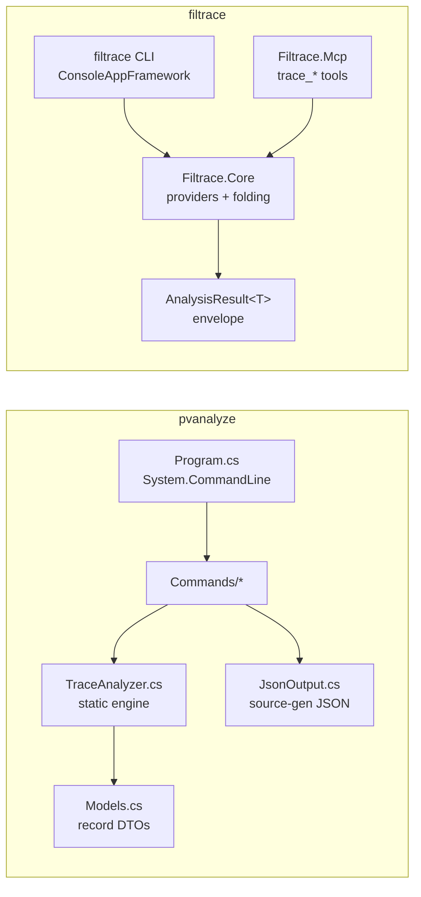

# pvanalyze vs. filtrace: a deep-dive comparison

A side-by-side analysis of two command-line .NET trace analyzers:
[adityamandaleeka/pvanalyze](https://github.com/adityamandaleeka/pvanalyze) and
[JeremyKuhne/filtrace](https://github.com/JeremyKuhne/filtrace) (this repository).
Both read traces produced by the .NET diagnostics stack and answer performance
questions from a terminal, but they make different bets about scope, platform,
and how an AI agent should drive them.

> Analysis basis: pvanalyze at commit `208d2b8` (12 commands, single project) and
> filtrace at `main` (22 verbs, 15 MCP tools, three projects). Both are MIT-licensed,
> both target .NET 10, both build on `Microsoft.Diagnostics.Tracing.TraceEvent`,
> and both are distributable as `dnx`-launchable NuGet tools.

---

## Executive summary

**pvanalyze** is a lean, cross-platform "companion to PerfView" focused on
answering GC, allocation, JIT, CPU, and event questions from `.nettrace`
(EventPipe) captures on Mac, Linux, and Windows. It is a single AOT-compatible
project (~12 source files) with one static analysis engine (`TraceAnalyzer.cs`)
and a `System.CommandLine` front end. Its stand-out capabilities are **DATAS**
analysis (server-GC dynamic heap-count tuning decisions - genuinely rare), a
**timeline** view that correlates multiple event lanes (GC / CPU / exceptions /
alloc / JIT) into time buckets, and a **snapshot** that shows everything happening
in a window around a chosen millisecond. It deliberately ships **no** agent
scaffolding (no `SKILL.md` / `AGENTS.md`), betting that `--help` plus a README and
per-command `--format json` are enough context for a frontier coding agent to
drive it by shelling out.

**filtrace** is an agent-shaped analyzer that treats the AI agent as a
first-class client. It ships two heads over one analysis core: a `filtrace` CLI
(22 verbs) and an **MCP server** (15 `trace_*` tools) that returns a typed
envelope - `schemaVersion`, `warnings`, next-step `hints`, and the result -
so an agent gets structured, self-describing results without screen-scraping. It
reads **both** EventPipe (`.nettrace`, `.speedscope.json`) and **ETW** (`.etl`),
from **both** modern .NET and .NET Framework, which unlocks capabilities EventPipe
alone cannot express: **wall-clock `threadtime`** (running vs. blocked),
**multi-process** scoping, **native** GC/JIT/`memcpy` frames (`classify` +
`--native-symbols`), and physical **disk I/O**. It drills all the way to **source
lines** (`lines` / `heatmap`) via PDB extraction, **diffs** two runs, **captures**
its own ETW `.etl` (`collect`), and even records its own trust signal - a
**symbol-resolution rate** with a 0.8 gate that tells an agent when a ranking
should not be believed. It carries parity tests against frozen oracles, an eval
harness, and a shipped skill.

**How they compare, in one paragraph.** The two tools overlap on the "read a
`.nettrace` and tell me about GC / CPU / allocations / exceptions / JIT / events"
core, and they even share the same NuGet plumbing (`dnx`, TraceEvent, speedscope
export, an ETLX cache with a `clean` verb). They diverge on almost everything
around that core. pvanalyze optimizes for **breadth-per-line-of-code and
cross-platform reach**: a small, readable, AOT-friendly binary that leans into
EventPipe and adds two temporal views (timeline, snapshot) and one deep GC
specialty (DATAS) that filtrace lacks entirely. filtrace optimizes for **depth,
provenance, and agent ergonomics**: more metrics (adds threadtime, contention,
wait, activity), finer drill-down (source lines), more capture formats (ETW +
capture verb), a two-run diff, and a structured MCP contract with trust gating
and steering hints. If you want one lean binary that runs anywhere and is
brilliant at GC/DATAS timelines, reach for pvanalyze. If you want an agent to run
a rigorous orient -> rank -> drill -> compare loop across EventPipe *and* ETW,
down to the source line, reach for filtrace. Neither is a superset of the other,
and because both are MIT-licensed and share a runtime substrate, the strongest
ideas in each are portable to the other.

---

## Tool overviews

### pvanalyze

| Aspect | Detail |
|---|---|
| Positioning | Cross-platform CLI "companion to PerfView"; automation, CI, agents, non-Windows devs |
| Primary input | `.nettrace` (EventPipe); reads via `Etlx.TraceLog`, so `.etl` works on Windows too |
| Projects | One (`pvanalyze.csproj`), AOT-compatible, self-contained publish possible |
| Dependencies | `TraceEvent` 3.1.28, `System.CommandLine` 2.0.9 |
| Structure | `Program.cs` (root command) -> `Commands/*` -> `TraceAnalyzer.cs` (static engine) -> `Models.cs` (record DTOs) |
| Commands (12) | `info`, `gcstats`, `jitstats`, `cpustacks`, `alloc`, `exceptions`, `events`, `calltree`, `timeline`, `snapshot`, `datas`, `clean` |
| Agent story | Shell out + `--format json`; **intentionally no** `SKILL.md` / `AGENTS.md` |
| JSON | Per-command source-generated `JsonSerializerContext`, async serialization |
| Signature strengths | **DATAS** tuning analysis, **timeline** multi-lane correlation, **snapshot** window, per-method temporal `SampleBuckets`, rich `events` filtering |

### filtrace

| Aspect | Detail |
|---|---|
| Positioning | Agent-shaped analyzer; CLI + MCP over one core; EventPipe **and** ETW, .NET **and** .NET Framework |
| Primary input | `.nettrace`, `.speedscope.json`, **and** `.etl` |
| Projects | Three: `Filtrace.Core` (engine), `Filtrace` (CLI), `Filtrace.Mcp` (MCP shim) |
| Dependencies | `TraceEvent`, `KlutzyNinja.Touki` (NuGet) |
| Structure | ConsoleAppFramework verbs -> executors -> `Filtrace.Core` providers; MCP `TraceTools` -> same core |
| Verbs (22) | `info`, `rank`, `cpu`, `alloc`, `exceptions`, `threadtime`, `callers`, `lines`, `heatmap`, `tree`, `processes`, `classify`, `diff`, `export`, `gcstats`, `jitstats`, `threadpool`, `diskio`, `events`, `collect`, `convert`, `clean` |
| MCP tools (15) | `trace_info`, `trace_rank`, `trace_callers`, `trace_lines`, `trace_heatmap`, `trace_tree`, `trace_processes`, `trace_classify`, `trace_diff`, `trace_export`, `trace_gc`, `trace_jit`, `trace_threadpool`, `trace_diskio`, `trace_query_events` |
| Agent story | First-class MCP server (typed envelope: `schemaVersion` / `warnings` / `hints`), shipped skill, eval harness |
| JSON | One `FiltraceJsonContext`, deterministic rounding, `OutputBudget` token budget |
| Signature strengths | Wall-clock `threadtime`, multi-process ETW, source-line drill, `diff`, `classify` + native symbols, ETW `collect`, symbol-rate trust gate, benchmark/activity/time scoping |

---

## Architecture comparison

**pvanalyze - one engine, many command shims.** Every command is a thin
`System.CommandLine` wrapper that calls a `static` method on `TraceAnalyzer`, which
returns a `record` from `Models.cs`; the command then prints text or hands the
record to a source-generated JSON context. It is easy to read end-to-end and has
almost no indirection. The cost of the single-static-engine design is that
cross-cutting concerns (scoping, symbol quality, hints) are per-command
decisions rather than a shared contract, and there is no separate library to reuse
from another host.

**filtrace - one core, two heads, one envelope.** Analysis lives entirely in
`Filtrace.Core` as provider classes (`CpuStackReader`, `ThreadTimeProvider`,
`AllocationProvider`, `ContentionProvider`, `WaitProvider`, `GcStatsProvider`,
`JitStatsProvider`, `ThreadPoolProvider`, `DiskIoProvider`, `ExceptionsProvider`,
`ActivityProvider`, ...) plus a folding aggregator and scope filters. The CLI and
the MCP server are both thin adapters over that core, and both emit the same
`AnalysisResult<T>` envelope. This is more moving parts than pvanalyze, but it buys
a single output contract, a reusable library, parity-testable providers, and an
MCP surface that advertises an `outputSchema` per tool.

**Consequence.** pvanalyze is the better starting point to read, fork, or AOT into
a single file. filtrace is the better substrate to extend behind a stable,
machine-checkable contract (its CI enforces a CLI help line budget and an MCP
token budget).

---

## Functionality comparison matrix

Legend: **Y** = present, **-** = absent, **~** = partial / indirect.

| Capability | pvanalyze | filtrace | Notes |
|---|:---:|:---:|---|
| **Inputs** | | | |
| `.nettrace` (EventPipe) | Y | Y | Both |
| `.speedscope.json` | - | Y | filtrace reads speedscope as CPU input |
| `.etl` (ETW) | ~ | Y | pvanalyze can via `TraceLog` on Windows, but not positioned/scoped for it |
| .NET Framework traces | ~ | Y | filtrace explicitly supports NGEN/.NET Framework |
| **Orientation** | | | |
| `info` metadata | Y | Y | Duration, events, processes |
| Symbol-resolution rate + trust gate | - | Y | filtrace's 0.8 threshold + warnings |
| Available-analyses routing hint | - | Y | filtrace `info` routes a symptom to a metric |
| **CPU** | | | |
| Self / exclusive ranking | Y | Y | Both |
| Inclusive ranking | Y | Y | Both |
| Group by module / namespace | Y | ~ | pvanalyze `cpustacks --group-by`; filtrace folds helpers |
| Per-method temporal buckets | Y | ~ | pvanalyze `SampleBuckets`; filtrace uses `--time` windows |
| Call tree (top-down) | Y | Y | pvanalyze `calltree`, filtrace `tree` |
| Hot-path auto-follow | Y | - | pvanalyze follows child >= 80% of parent |
| Callers of a frame | Y | Y | Both |
| Bidirectional caller+callee view | Y | ~ | pvanalyze `--caller-callee`; filtrace splits `callers` / `tree` |
| Source-line attribution | - | Y | filtrace `lines` / `heatmap` via PDBs |
| **Wall-clock / blocking** | | | |
| Thread-time (running vs. blocked) | - | Y | filtrace `threadtime` (ETW) |
| Lock contention metric | - | Y | filtrace `rank --metric contention` |
| Wait / `WaitHandle` metric | - | Y | filtrace `rank --metric wait` |
| **Memory** | | | |
| Allocation by type/site | Y | Y | Both use `GC/AllocationTick` |
| LOH breakout | Y | ~ | pvanalyze flags large-object count/bytes |
| **GC** | | | |
| GC summary stats | Y | Y | Both |
| Per-GC timeline / longest pauses | Y | ~ | pvanalyze `--timeline` / `--longest` |
| **DATAS heap-count tuning** | **Y** | **-** | pvanalyze exclusive; server-GC dynamic adaptation |
| **JIT** | Y | Y | Both |
| **Exceptions** | | | |
| Throw list + type summary | Y | ~ | pvanalyze lists occurrences + summary |
| Throw-site call stacks | - | Y | filtrace ranks exception stacks (where thrown) |
| **Events** | | | |
| List event types | Y | Y | Both |
| Filter by name/provider | Y | Y | Both |
| Filter by PID/TID | Y | ~ | pvanalyze explicit flags |
| Payload content search | Y | - | pvanalyze `--payload` substring search |
| **Cross-cutting temporal** | | | |
| Multi-lane timeline correlation | **Y** | **-** | pvanalyze `timeline` |
| Point-in-time snapshot window | **Y** | **-** | pvanalyze `snapshot` |
| Time-window scoping | Y | Y | pvanalyze `--from/--to`; filtrace `--time` |
| **Scoping** | | | |
| Multi-process CPU scoping | ~ | Y | filtrace auto-scopes to busiest + `--process` |
| Root / subtree scoping | - | Y | filtrace `--root` |
| BenchmarkDotNet scoping | - | Y | filtrace `--benchmark` |
| Activity (request/job) scoping | - | Y | filtrace `--activity` |
| **Compare** | | | |
| Two-trace diff | - | Y | filtrace `diff` |
| **Runtime internals** | | | |
| Native symbols (GC/JIT/memcpy) | - | Y | filtrace `--native-symbols` |
| Work-category classification | - | Y | filtrace `classify` |
| Thread-pool starvation report | - | Y | filtrace `threadpool` |
| Physical disk I/O by file | - | Y | filtrace `diskio` (ETW) |
| **Export** | | | |
| speedscope | Y | Y | Both |
| chromium / Perfetto | - | Y | filtrace `export --format chromium` |
| **Capture** | | | |
| Built-in ETW capture | - | Y | filtrace `collect` (Windows, elevated) |
| **Agent integration** | | | |
| JSON output | Y | Y | Both |
| MCP server | - | Y | filtrace 15 `trace_*` tools |
| Structured envelope (warnings/hints) | - | Y | filtrace |
| Shipped skill / agent docs | - (by design) | Y | filtrace ships a skill |
| Output token budget | - | Y | filtrace `OutputBudget` + CI gate |
| **Engineering** | | | |
| Parity/oracle tests | - | Y | filtrace |
| Eval harness | - | Y | filtrace `eval/` |
| AOT self-contained single file | Y | ~ | pvanalyze `IsAotCompatible`, self-contained publish |

---

## Where each tool is clearly stronger

### pvanalyze's distinctive strengths

1. **DATAS analysis (`datas`).** Parses the `DotNETRuntime` dynamic-adaptation
   events and reports server-GC heap-count tuning decisions: heap-count range and
   transitions, per-GC budget/TCP/MSL samples, gen2 backstop tuning, and a
   changes-only view "ideal for agents." This is deep, current (.NET 9+), and has
   no equivalent in filtrace or most other tools.
2. **Timeline correlation (`timeline`).** Buckets the trace over time and emits
   parallel lanes - GC, CPU (with the top method per bucket), exceptions, alloc,
   JIT, raw events - so a single call answers "what was happening when?" filtrace
   can *scope* to a time window but has no correlated multi-lane overview.
3. **Point-in-time snapshot (`snapshot`).** Given a millisecond and a window,
   returns the GC, top CPU methods, exceptions, and event-type counts around that
   instant - a purpose-built "what was going on at the spike?" primitive.
4. **Per-method temporal sparkline (`SampleBuckets`).** `cpustacks` returns a
   time-bucketed sample histogram per method, so a caller can see *when* a hot
   method was hot, not just that it was.
5. **Event payload search (`events --payload`).** Substring search across payload
   *values* (e.g. `ConnectionReset`) plus PID/TID filters - a genuinely useful
   forensic filter filtrace's `events` does not offer.
6. **Lean, AOT-friendly, single-file.** One project, `IsAotCompatible`,
   self-contained publish per RID. Easy to read, fork, and drop onto a box with no
   SDK.

### filtrace's distinctive strengths

1. **Two heads over one core, with an MCP server.** 15 `trace_*` tools return a
   typed `AnalysisResult<T>` envelope (`schemaVersion`, `warnings`, `hints`, result)
   and advertise a per-tool `outputSchema`. An agent binds to a contract instead of
   parsing free-form stdout.
2. **Trust gating.** `info` reports a **symbol-resolution rate** and warns when it
   is below 0.8, so an agent knows when CPU rankings are not to be believed - a
   provenance signal pvanalyze lacks.
3. **Wall-clock and blocking metrics.** `threadtime` (running vs. blocked),
   `contention`, and `wait` answer "slow but the CPU is idle - what is it waiting
   on?" - the question EventPipe-CPU-only tools cannot.
4. **Source-line drill.** `lines` and `heatmap` extract embedded PDBs and attribute
   cost to source lines and files - the last mile from "hot method" to "fix this
   line."
5. **ETW breadth.** Multi-process scoping (auto-scope to the busiest tree +
   `--process`), native GC/JIT/`memcpy` frames (`--native-symbols`), work-category
   `classify`, physical `diskio`, and a built-in `collect` capture verb.
6. **Compare.** `diff` turns two traces into a regression report - the fourth move
   of its orient -> rank -> drill -> compare loop.
7. **Scoping vocabulary.** `--root`, `--benchmark` (BDN workload), `--activity`
   (one request/job), and `--time` let an agent zoom to exactly the relevant slice.
8. **Engineering rigor for agents.** Deterministic rounding, an output **token
   budget**, parity tests against frozen oracles, an eval harness, and a shipped
   skill with CI drift checks.

---

## Design philosophy contrast

| Dimension | pvanalyze | filtrace |
|---|---|---|
| Core bet | Breadth per line of code; cross-platform reach | Depth + provenance + agent contract |
| Platform center of gravity | EventPipe, any OS | EventPipe **and** ETW, Windows-forward for ETW-only features |
| Agent interface | Shell + `--format json`; trust the model to read `--help` | MCP tools + typed envelope + shipped skill |
| Temporal analysis | First-class (timeline, snapshot, buckets) | Scoping-based (`--time`, `--activity`) |
| GC specialization | Deep (DATAS) | Broad (gcstats, classify, threadpool) |
| Trust signal | Implicit (author trusts frontier models) | Explicit (symbol-rate gate, warnings, hints) |
| Extensibility | Fork the single project | Add a provider behind a stable contract |
| Distribution | One AOT binary | Two NuGet heads (`dnx`) |

The philosophies are complementary, not contradictory. pvanalyze's author
explicitly bets that "today's frontier models" need no skill file; filtrace bets
that a machine-checkable contract (envelope + schema + hints + token budget) pays
off across model generations and lets weaker/cheaper models succeed too. Both bets
can be right for different audiences - and each tool can borrow the other's bet
without abandoning its own.

---

## Improvement plans

Both projects are MIT-licensed and share a runtime substrate (`TraceEvent`,
.NET 10, `dnx`, speedscope, an ETLX cache), so these are realistic ports, not
rewrites.

### Improvement plan for filtrace (adopt pvanalyze's strengths)

Priority order reflects value-to-effort given filtrace's existing provider model.

1. **Add a `datas` verb and `trace_datas` tool.** *(High value, self-contained.)*
   Port pvanalyze's `DatasParser` (MIT) into a `DatasProvider` in `Filtrace.Core`,
   wrap it in the `AnalysisResult<T>` envelope, and expose a changes-only mode.
   filtrace already has `gcstats`; DATAS is the natural .NET 9+ extension and is the
   single biggest capability gap. Add parity coverage against a captured
   DATAS-enabled `.nettrace` fixture.
2. **Add a `timeline` verb and `trace_timeline` tool.** *(High agent value.)* A
   correlated multi-lane, time-bucketed overview (GC / CPU-top-method / exceptions /
   alloc / JIT) gives the orient step a *temporal* dimension to complement the
   metric dimension. It composes cleanly with the existing providers and with
   `hints` ("spike at bucket 42 -> `rank --time 4100,4300`").
3. **Add a `snapshot` verb and `trace_snapshot` tool.** *(Reuses existing
   providers.)* "What was happening at T ms?" - GC, top CPU frames, exceptions, and
   event counts in a window. filtrace already has every underlying provider and
   `--time` scoping; snapshot is a cross-provider aggregation plus a steering hint.
4. **Bidirectional caller/callee view.** Extend `callers` (or add
   `trace_callercallee`) to return callers *and* callees around a focus frame in one
   result, with pvanalyze-style substring matching so an agent need not pass an exact
   signature.
5. **Payload content search in `events` / `trace_query_events`.** Add a `--payload`
   substring filter across payload values plus explicit `--pid` / `--tid` flags. Low
   cost, high forensic value.
6. **Per-method temporal buckets in rankings.** Optionally attach a small
   `SampleBuckets` sparkline to `rank`/`cpu` rows so a ranking reveals *when* a frame
   was hot without a second query. Keep it behind a flag to respect the token budget.

### Improvement plan for pvanalyze (adopt filtrace's strengths)

Priority order reflects value to pvanalyze's cross-platform, agent-driven audience.

1. **Add an MCP server head.** *(Highest leverage.)* pvanalyze already produces
   per-command JSON records; wrapping them as `trace_*`-style MCP tools with a small
   shared envelope (a `warnings`/`hints` wrapper around the existing records) turns
   "shell out and parse stdout" into a bound contract. Given the contributor list
   (agent-forward .NET folks), this is on-brand and mostly plumbing over existing
   DTOs.
2. **Report a symbol-resolution / trust signal in `info`.** Compute the fraction of
   CPU samples whose leaf frame resolved to a managed method and surface it (plus a
   warning below a threshold). Without it, an agent cannot tell a trustworthy
   `cpustacks` from a symbol-starved one - the single most important guardrail
   filtrace has that pvanalyze lacks.
3. **Emit next-step hints.** Add an optional `hints` array to each JSON response
   ("top method is X -> `calltree --caller-callee X`"). Cheap to add, and it makes
   the tool self-navigating for agents - consistent with the "no skill file needed"
   philosophy by moving guidance into the output itself.
4. **Source-line attribution.** A `lines` command that resolves hot methods to
   source lines from portable PDBs (filtrace extracts embedded PDBs) would take
   pvanalyze from "hot method" to "hot line" - the highest-value drill for actually
   fixing code.
5. **Blocking analysis.** Add a wall-clock/blocked view. On EventPipe this can start
   from `ContentionStart/Stop` and the `WaitHandle` keyword (a `contention` and a
   `wait` command); full `threadtime` needs ETW/context-switch data but even the
   EventPipe subset answers "am I CPU-bound or blocked?".
6. **Multi-process CPU scoping.** `cpustacks`/`calltree` currently build a global
   stack source; adopt filtrace's auto-scope-to-busiest-process plus a `--process`
   selector so a multi-process capture is not silently blended.
7. **A `diff` command.** Compare two traces' `cpustacks`/`gcstats`/`alloc` and report
   what moved. Regression triage is a common CI use case pvanalyze is otherwise well
   placed for.
8. **An output token budget.** A `--max-rows` / budget default keeps JSON responses
   cheap for agents on large traces, mirroring filtrace's `OutputBudget`.

### Shared / ecosystem opportunities

- **A shared DATAS parser.** DATAS parsing is fiddly and versioned; a small shared
  MIT component (or a straight port in each direction) avoids two drifting
  implementations.
- **A common JSON envelope.** If both tools converged on a minimal
  `{ schemaVersion, warnings, hints, result }` shape, an agent could consume either
  interchangeably and switch tools by capability rather than by output format.
- **Complementary positioning rather than duplication.** pvanalyze as the lean,
  cross-platform GC/DATAS/timeline specialist; filtrace as the agent-native,
  ETW-capable, source-line + capture + diff workhorse. An agent could legitimately
  install both and route by question: DATAS/timeline/snapshot -> pvanalyze;
  threadtime/source-line/multi-process/diff -> filtrace. Aligning their JSON and
  hint conventions would make that routing seamless.
- **Cross-pollinate fixtures.** filtrace's oracle/parity fixtures and pvanalyze's
  DATAS-enabled captures are exactly the traces the other project needs to test the
  borrowed features.

---

## Bottom line

pvanalyze and filtrace solve the same *category* of problem with opposite instincts.
pvanalyze proves how much analytical value fits in one small, cross-platform,
AOT-friendly binary, and it owns three areas outright - **DATAS**, **timeline**
correlation, and **snapshot**. filtrace proves how far the agent-native, contract-first
approach goes - an **MCP server** with typed envelopes, **trust gating**,
**source-line** drill, **wall-clock/blocking** metrics, **ETW** breadth, **capture**,
and **diff** - at the cost of more moving parts. Each tool's signature strengths map
almost perfectly onto the other's gaps, so the most productive path for both is
mutual borrowing: filtrace gaining DATAS/timeline/snapshot, pvanalyze gaining an MCP
head, a trust signal, hints, and source-line drill - ideally over a shared envelope
so the .NET diagnostics ecosystem gets two complementary, interoperable analyzers
rather than two overlapping ones.
